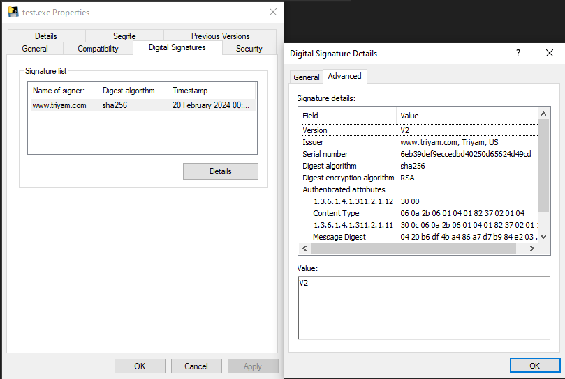
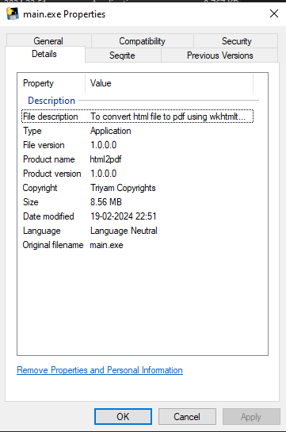

# Self-Sign Process:

## 1.a. *(Creating .pfx file)*: Self-Signed Certificate

```powershell
# Create a self-signed certificate
$cert = New-SelfSignedCertificate -Type Custom -Subject "CN=www.triyam.com, O=Triyam, C=US" -KeyUsage DigitalSignature -FriendlyName "Triyam Coders" -CertStoreLocation "Cert:\CurrentUser\My" -TextExtension @("2.5.29.37={text}1.3.6.1.5.5.7.3.3", "2.5.29.19={text}")

# Specify the password for the PFX file
$password = ConvertTo-SecureString -String "Triyam@1234" -Force -AsPlainText

# Export the certificate as PFX
Export-PfxCertificate -Cert $cert -FilePath "C:\Users\pavithiran\Desktop\Certificate.pfx" -Password $password
```

**Explanation:**

- `New-SelfSignedCertificate`: Creates a self-signed certificate with specified parameters.
- `ConvertTo-SecureString`: Converts the password to a secure string.
- `Export-PfxCertificate`: Exports the certificate as a PFX file.

-------------------------------
### 1.b. Sign an Executable using sign>tool
>Note: For **signtool**, by installing [Windows SDK](https://developer.microsoft.com/en-us/windows/downloads/windows-sdk/) we can install. Also need to add environment path `(C:\Program Files (x86)\Windows Kits\10\App Certification Kit)` to use it.

>We can also install *only signtool* but not advisiable I guess, [Check this](https://stackoverflow.com/a/52963704/1070129).

```powershell
# Sign the executable
signtool sign /tr http://timestamp.digicert.com /td sha256 /fd sha256 /a /f Certificate.pfx /p Triyam@1234 main.exe

# Verify the signature
signtool verify /pa /v main.exe
```

**Explanation:**
- `signtool sign`: Signs the executable using the provided certificate (Certificate.pfx).
- `/tr`: Specifies the timestamp server.
- `/td`: Specifies the hash algorithm for the timestamp server.
- `/fd`: Specifies the hash algorithm for the file digest.
- `/a`: Automatically selects the best signing certificate.
- `/f`: Specifies the PFX file containing the certificate.
- `/p`: Specifies the password for the PFX file.
- `signtool verify`: Verifies the signature of the executable.


>The above image also has the pyinstaller based details.
----

## 2. *Using pyinstaller*: Integrate Version Information using PyInstaller

```powershell
# PyInstaller command
pyinstaller --onefile --version-file=version_info.txt main.py

# For having a icon
pyinstaller --onefile --version-file=version_info.txt --icon=triyam-logo.ico .\html2pdf.py
```
**version_info.txt**
```python
# version_info.txt
VSVersionInfo(
    ffi=FixedFileInfo(
        filevers=(1, 0, 0, 0),
        prodvers=(1, 0, 0, 0),
        mask=0x3f,
        flags=0x0,
        OS=0x4,
        fileType=0x1,
        subtype=0x0,
        date=(0, 0)
    ),
    kids=[
        StringFileInfo(
            [
                StringTable(
                    u'040904B0',
                    [
                        StringStruct(u'CompanyName', u'Triyam'),
                        StringStruct(u'FileDescription', u'To convert html file to pdf using wkhtmltopdf'),
                        StringStruct(u'FileVersion', u'1.0.0.0'),
                        StringStruct(u'InternalName', u'Pavithiran'),
                        StringStruct(u'LegalCopyright', u'Triyam Copyrights'),
                        StringStruct(u'OriginalFilename', u'main.exe'),
                        StringStruct(u'ProductName', u'html2pdf'),
                        StringStruct(u'ProductVersion', u'1.0.0.0')
                    ]
                )
            ]
        ),
        VarFileInfo([VarStruct(u'Translation', [0, 1200])])
    ]
)
```

**Explanation:**

- `pyinstaller --onefile`: Packages the Python script into a single executable file.
- `--version-file`: Specifies the version information file for integration.



----

# Authorized signing code:
>Note: It's a bit complex to perform that process.
- [Check out](https://stackoverflow.com/a/66582477/1070129)

****


